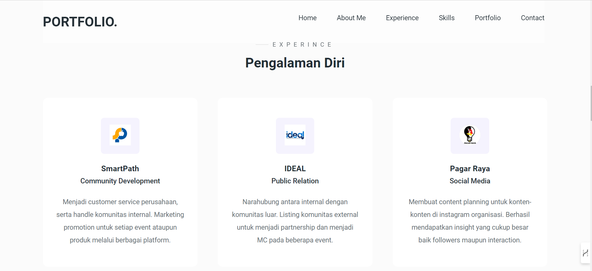

# Portfolio Muhammad Asyraf

## Fitur Website

- Terdapat 6 section yang dapat dilihat
- Pada Navbar, setipa menu dapat diklik untuk langsung scroll ke section
- Deployment portfolio dapat dilihat melalui icon link pada tiap porto
- Form contact dapat diisi dan dikirim yang nantinya akan terkirim ke email
- Semua icon sosmed telah terlink pada sosmed aslinya

## Teknologi

Teknologi dalam pembuatan website ini diantaranya:

- [HTML] - Sebagai kerangka website
- [CSS] - Untuk responsive dan gaya UI
- [JavaScript] - Perubahan responsive layar dan memebrsihkan form setelah kirim
- [Formspree] - API untuk mengirim pesan ke email saya

## Instalasi

- Download folder melalui github ini
- buka folder Projek 2
- Buka file index.html
- Secara otomatis browser akan terbuka dan menampilkan website berikut
- Atau buka langsung deployment melalui link berikut ([Portfolio Asyraf](https://asyraf28.github.io/Asyraf-Portfolio/))

## Tampilan Website

- Hero Section
  
- About Me Section
  
- Experience Section
  
- Skills & Education Section
  
- Portfolio Section
  
- Contact Section
  
- Footer
  
